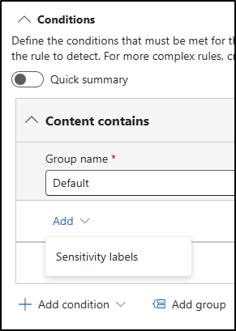

# Bonus task – Create a DLP policy for Copilot

Megan Bowen has already classified Contoso project data with sensitivity labels. To strengthen protections, she now needs to add a safeguard that prevents Microsoft 365 Copilot from processing content marked with the Project data label. This helps Contoso reduce the chance of sensitive information being used in prompts or responses.

**Task**:

- Create a DLP policy in simulation mode

## Task 1 – Create a DLP policy in simulation mode

With classification in place, you’ll now create a DLP policy in Microsoft Purview that targets content labeled as project data. The policy will run in simulation mode and prevent Copilot from processing labeled content.

1. In the Microsoft Purview portal, navigate to **Solutions** > **Data Loss Prevention** > **Policies**.

1. On the **Policies** page, select **+ Create policy** to start the configuration for creating a new data loss prevention policy.

1. On the **Choose what type of data to protect** page, select **Data stored in connected sources**, then select **Next**.

1. On the **Start with a template or create a custom policy** page, select **Custom** as the category, then select **Custom policy** under **Regulations**.

1. Select **Next**.

1. On the **Name your DLP policy** page enter:

   - **Name**: `Block project data in Copilot`
   - **Description**: `Restricts Copilot from processing content labeled as project data.`

1. Select **Next**.

1. On the **Assign admin units** page select **Next**.

1. On the **Choose locations to apply the policy** page, enable the location for **Microsoft 365 Copilot** only. If any other locations are selected, deselect them.

1. Select **Next**.

1. On the **Define policy settings** page, select **Create or customize advanced DLP rules**, then select **Next**.

1. On the **Customize advanced DLP rules** page, select **+ Create rule**.

1. In the **Create rule** flyout:

   - In the **Name** field, enter `Block project data in Copilot`.

1. Under **Conditions**, select **+ Add condition** > **Content contains**.

1. In the **Content contains** section, select **Add** > **Sensitivity labels**.

   

1. In the **Sensitivity labels** flyout, select the checkbox next to the **Project data** label, then select **Add**.

1. Back on the **Create rule** flyout, under **Actions**, select **+ Add an action** > **Restrict Copilot from processing content**.

1. Select **Save** at the bottom of the flyout.

1. Back on the **Customize advanced DLP rules** page, select **Next**.

1. On the **Policy mode** page, select Run the policy in simulation mode, then select both checkboxes:

   - Show policy tips while in simulation mode
   - Turn the policy on if it's not edited within fifteen days of simulation

1. Select **Next**.

1. On the **Review and finish** page, select **Submit**.

1. On the **New policy created** page select **Done**.

You created a DLP policy for Microsoft 365 Copilot that targets the Project data label and runs in simulation mode. This adds a guardrail on top of labeling by preventing Copilot from processing content labeled as project data.
