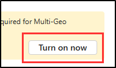

# Lab – Classify and protect project data with information protection in Copilot

Megan Bowen, the Information Security Administrator at Contoso Ltd., is updating the organization's information protection strategy to reduce the risk of sensitive data showing up in Microsoft 365 Copilot. After previous incidents where personal data surfaced in support tickets, she needs to create and test custom sensitive information types that detect Contoso project codes and other sensitive information. These classifications will later support labels and policies that protect content from being exposed in Copilot or shared inappropriately.

**Tasks**:

1. Enable Audit in the Microsoft Purview portal
1. Create a custom sensitive information type
1. Test custom sensitive information types
1. Create a parent sensitivity label
1. Create a sublabel
1. Publish sensitivity labels
1. Configure auto-apply labeling

## Task 1 – Enable Audit in the Microsoft Purview portal

Audit records user and administrator activity, and you'll need it enabled to continue with creating auto-apply sensitivity labels in this session.

1. Log into Client 1 VM (SC-401-CL1) with the **Admin** account.

1. Open Microsoft Edge.

1. In **Microsoft Edge**, navigate to `https://purview.microsoft.com` and sign in as **Megan Bowen** (`MeganB@WWLxZZZZZZ.onmicrosoft.com`, where ZZZZZZ is your unique tenant ID). Use the password provided by your lab host.

1. Select **Get started** on the welcome message for the new Microsoft Purview portal.

    

1. From the left sidebar, select **Solutions**, then select **Audit**.

1. On the **Search** page, select **Start recording user and admin activity** to enable audit logging.

    

1. Verify that the blue bar disappears from the page after you enable auditing.

You've successfully enabled Audit in Microsoft Purview. With auditing active, you're ready to move on to creating custom sensitive information types and sensitivity labels.

## Task 2 – Create a custom sensitive information type

In this task, you'll create a custom sensitive information type (SIT) to detect Contoso project codes. The built-in SITs don't match this format, so you need a custom one to ensure project codes can be consistently identified and protected.

1. From the left sidebar, select **Solutions**, then select **Information Protection**.

1. Expand **Classifiers**, then select **Sensitive info types**.

1. On the **Sensitive info types** page, select **+ Create sensitive info type**.

1. On the **Name your sensitive info type** page, enter:

   - **Name**: `Contoso Project Codes`
   - **Description**: `Pattern for Contoso project code identifiers.`

1. Select **Next**.

1. On the **Define patterns for this sensitive info type** page, select **Create one now**.

1. On the **New pattern** flyout, select **+ Add primary element** > **Regular expression**.

1. On the **+ Add a regular expression** flyout, enter:

   - **ID**: `Contoso project code regex`
   - **Regular expression**: `[A-Z]{2}-[0-9]{4}-[0-9]{3}`
   - Select the radio button for **String match**.
   - Select **Done**.

1. Back on the **New pattern** flyout, under **Supporting elements**, select **+ Add supporting elements or group of elements**, then select **Keyword list**.

1. On the **Add a keyword list** flyout, enter:

   - **ID**: `Project code keywords`
   - In **Keyword Group #1** under **Case insensitive**:

    ```text
    Project
    Code
    Identifier
    ```

   - Select the radio button for **Word match**.
   - Select **Done**.

1. Back on the **New pattern** flyout, set **Detect primary AND supporting elements** to **100** characters.

1. Select **Create** at the bottom of the flyout.

1. Back on the **Define patterns for this sensitive info type** page, select **Next**.

1. On the **Choose the recommended confidence level to show in compliance policies** page, keep the default value, then select **Next**.

1. On the **Review settings and finish** page, review your configuration, then select **Create**. After the SIT is created, select **Done**.

You've successfully created a new sensitive information type to identify Contoso project codes. Custom SITs allow you to detect and classify organization-specific data so it can be protected through Microsoft Purview policies.

## Task 3 – Test custom sensitive information types

In this task, you'll confirm that the custom sensitive information type (SIT) for project codes detects data correctly before it's used in policies. Testing ensures the regex and keywords work as expected.

1. On the taskbar in Windows, search for **Notepad** and open the app.

1. In Notepad, enter:

    ```text
    The Contoso project code PR-2025-001 has been assigned to this work.
    ```

1. Select **File** > **Save As**.

1. In the **Documents** folder, enter `ProjectCodeTest.txt` as the **File name**, then select **Save**.

1. Close Notepad.

1. In **Microsoft Edge**, return to the **Microsoft Purview portal** tab. You should still be on the Sensitive info types page in the Purview portal.

1. Search for `Contoso Project Codes`, then select the SIT.

1. Select **Test**.

1. On the **Upload file to test "Contoso Project Codes"** flyout, select **Upload file**.

1. Browse to the **Documents** folder, select `ProjectCodeTest.txt`, then select **Open**.

1. Select **Test** to start the analysis.

1. On the **Match results** page, review the results, then select **Finish**.

You've successfully tested the custom sensitive information type for project codes. Testing confirms the SIT works as intended, so you can now use it to help protect sensitive content across Microsoft Purview.

## Task 4 – Create a parent sensitivity label

In this task, you'll enable support for sensitivity labels in SharePoint and OneDrive, then create a parent label to organize department- or project-specific sublabels. This parent label provides a simple foundation for the Copilot-related sublabel you'll configure in the next task.

1. In the **Microsoft Purview portal**, navigate to **Solutions** > **Information Protection**.

1. On the **Information Protection** page, select **Sensitivity labels** from the left navigation.

1. At the top of the page, select **Turn on now** in the banner to enable support for sensitivity labels in SharePoint and OneDrive.

   

1. On the **Sensitivity labels** page, select **+ Create a label**.

1. On the **Provide basic details for this label** page, enter:

   - **Name**: `Internal`
   - **Display name**: `Internal`
   - **Description for users**: `Use this label for internal Contoso content.`
   - **Description for admins**: `Parent label for internal content. Used to organize sublabels, including Copilot project data.`

1. Select **Next**.

1. On the **Define the scope for this label** page, select **Files** and **Emails**. If **Meetings** is selected, deselect it.

1. Select **Next** until you reach the **Review your settings and finish** page, then select **Create label**.

1. On the **Your sensitivity label was created** page, select **Don't create a policy yet**, then select **Done**.

You've created a parent sensitivity label named **Internal**. This label provides a foundation for organizing sublabels, including the Copilot project data sublabel you'll configure next.

## Task 5 – Create a sublabel

Now that you have a base label, you'll create a sublabel specifically for project data. This sublabel will later be used with an auto-apply policy so that content containing project codes is automatically labeled and protected.

1. On the **Sensitivity labels** page, find the newly created **Internal** sensitivity label. Select the vertical ellipsis (**...**) next to it, then select **+ Create sublabel**.

   

1. The **New sensitivity label** wizard will open. On the **Provide basic details for this label** page enter:

   - **Name**: `Project data`
   - **Display name**: `Project data`
   - **Description for users**: `Label for documents and emails that contain Contoso project codes.`
   - **Description for admins**: `This sublabel is used with auto-apply policies to protect project data and reduce Copilot exposure.`

1. Select **Next**.

1. On the **Define the scope for this label** page, select **Files** and **Emails**. Make sure **Meetings** is deselected.

1. On the **Choose protection settings for labeled items** page, select **Apply content marking**, then select **Next**.

1. On the **Content marking** page, enable **Content marking**.

1. Select the checkbox for **Add a footer**, then select **Customize text**.

1. In the **Customize footer text** flyout, enter:

   - **Footer text**: `Contoso Project Data - Confidential`
   - **Font size**: `10`
   - **Font color**: Black
   - **Align text**: Left
   - Select **Save**.

1. Back on the **Content marking** page, select **Next**.

1. Keep the default settings on the remaining pages by selecting **Next** until you reach the **Review your settings and finish** page.

1. Select **Create label**.

1. On the **Your sensitivity label was created** page, select **Don't create a policy yet**, then select **Done**.

You've created a sublabel that applies a footer to project data. When used with an auto-apply policy, this label automatically classifies project documents and emails and makes them clearly identifiable.

## Task 6 – Publish sensitivity labels

You've created a sublabel that applies a footer to project data. When used with an auto-apply policy, this label automatically classifies project documents and emails and makes them clearly identifiable, reducing the chance they surface in Copilot responses.

1. In the Microsoft Purview portal, under **Information Protection**, expand **Policies** then select **Label publishing policies**.

1. On the **Label policies** page, select **Publish labels**.

1. On the **Choose sensitivity labels to publish** page, select **Choose sensitivity labels to publish**.

1. On the **Sensitivity labels to publish** flyout, select the checkboxes for:

   - **Internal**
   - **Internal/Project data**
   - Select **Add**

1. Back on the **Choose sensitivity labels to publish** page, select **Next** through the remaining pages until you reach the **Name your policy** page.

1. On the **Name your policy** page, enter:

   - **Name**: `Internal project data`
   - **Description**: `Makes Internal and Project data sensitivity labels available to users.`

1. Select **Next**, then on the **Review and finish** page, select **Submit**.

1. On the **New policy created** page, select **Done**.

You've successfully published the Internal and Project data sensitivity labels. They're now available for manual use and for auto-apply policies.

## Task 7 – Configure auto-apply labeling

In this task, you'll configure an auto-apply policy so that the Project data sublabel is automatically applied when Contoso project codes are detected. This ensures project data is consistently protected without relying on users to manually apply the label.

1. In the Microsoft Purview portal, under **Information Protection**, expand **Policies** then select **Auto-labeling policies**.

1. On the **Auto-labeling policies** page, select **+ Create auto-labeling policy**.

1. On the **Choose info you want this label applied to** page, create a policy in a **Custom** category for a **Custom policy** regulation.

1. Select **Next**.

1. On the **Name your auto-labeling policy** page, enter:

   - **Name**: `Auto-apply project data`
   - **Description**: `Automatically applies the Project data sensitivity label when Contoso project codes are detected.`  

1. Select **Next**.

1. On the **Choose a label to auto-apply** page, select **+ Choose a label**, then select **Next**.

1. On the **Choose a sensitivity label** flyout, select the checkbox for **Internal/Project data**, then select **Add**.

1. Back on the **Choose a label to auto-apply** page, select **Next**.

1. On the **Assign admin units** page, select **Next**.

1. On the **Choose locations where you want to apply the label** page, select:

   - **Exchange email**
   - **SharePoint sites**
   - **OneDrive accounts**

1. Select **Next**.

1. On the **Set up common or advanced rules** page, select **Common rules**, then select **Next**.

1. On the **Define rules for content in all locations** page, select **+ New rule**.

1. In the **New rule** flyout, enter:

   - **Name**: `Project data rule`
   - **Description**: `Detects Contoso project codes using the custom SIT.`

1. Under **Conditions**, select **+ Add condition** > **Content contains**.

1. Under the **Content contains** section, select **+ Add** > **Sensitive info types**.

1. In the **Sensitive info types** list, search for and select `Contoso Project Codes`, then select **Add**.

1. Leave **Exceptions** blank.

1. Select **Save** to finish creating the rule.

1. Select **Next**.

1. On the **Additional settings for email** page, select **Next**.

1. On the **Decide if you want to test out the policy now or later** page, select **Run policy in simulation mode**, and select the checkbox for **Automatically turn on policy if not modified after 7 days in simulation**.

1. Select **Next**.

1. On the **Review and finish** page, select **Create policy**.

1. On the confirmation page, select **Done**.

You've successfully configured an auto-apply policy for project data. Any content containing Contoso project codes is automatically labeled with the Project data sensitivity label, helping prevent sensitive information from appearing in Copilot responses or being shared inappropriately.

## Lab complete

You created and tested a custom sensitive information type, built sensitivity labels, published them, and configured auto-apply labeling. With these protections in place, project data is consistently classified and secured before it can appear in Copilot responses or be shared inappropriately.

If you'd like to extend this scenario, continue to the bonus task to add a DLP safeguard that controls how Copilot handles labeled project data.
